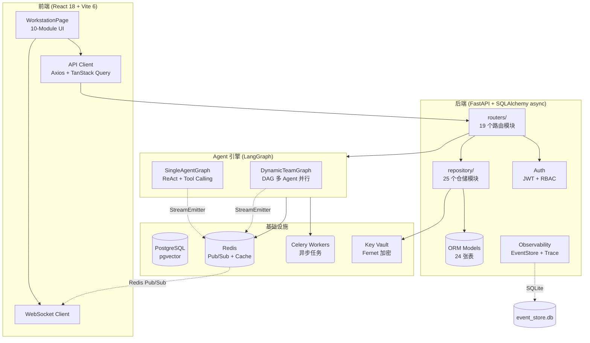

<div align="center">
<a name="readme-top"></a>

# AgentStudio

> AI Agent 编排平台 — 配置、编排、运行多 Agent 工作流。

[](https://opensource.org/licenses/MIT)
[](https://www.typescriptlang.org/)
[](https://reactjs.org/)
[](https://www.python.org/)
[](https://fastapi.tiangolo.com/)
[](https://langchain-ai.github.io/langgraph/)

[](https://github.com/CJLOdyssey/agent-studio/stargazers)
[](https://github.com/CJLOdyssey/agent-studio/network/members)
[](https://github.com/CJLOdyssey/agent-studio/issues)

</div>

<details>
<summary><kbd>目录</kbd></summary>

- [快速开始](#-快速开始)
- [功能特性](#-功能特性)
- [部署](#-部署)
- [支持](#-支持)
- [贡献](#-贡献)
- [License](#-license)

</details>

---

## 🚀 快速开始

```bash
git clone https://github.com/CJLOdyssey/agent-studio.git
cd agent-studio
cp .env.example .env  # 填入 DEEPSEEK_API_KEY
docker compose -f docker/compose.local.yml up -d
```

访问 http://localhost:5173

---

## ✨ 功能特性

### 双引擎执行

| 引擎 | 场景 | 特点 |
|------|------|------|
| SingleAgentGraph | 单 Agent 对话 | ReAct 模式，思考链流式输出 |
| DynamicTeamGraph | 多 Agent 工作流 | DAG 编排，fan-out/fan-in 并行 |

### 工作台

团队、工作流、Agent、提示词、工具、MCP、Skills、监控、审计日志 — 10 个模块一站式管理。

### 关键能力

- 实时流式输出 — WebSocket + Redis pub/sub
- MCP 协议支持 — 接入 Model Context Protocol
- BYOK 密钥保险箱 — Fernet 加密存储
- RBAC 认证 — JWT + 角色权限
- 全链路可观测 — trace 追踪、Prometheus 指标

---

## 🏗 项目架构



---

## 🛳 部署

| 方式 | 说明 |
|------|------|
| Docker | `docker compose -f docker/compose.local.yml up -d` |
| 混合模式 | Docker PG/Redis + 本地热重载 |
| 生产部署 | `docker compose -f docker/compose.prod.yml up -d` |
| Kubernetes | `helm install agent-studio ./helm` |

### 环境变量

| 变量 | 必填 | 说明 |
|------|------|------|
| `DATABASE_URL` | 是 | PostgreSQL 连接串 |
| `REDIS_URL` | 是 | Redis 连接串 |
| `AUTH_SECRET` | 是 | JWT 签名密钥（≥32字符） |
| `KEY_VAULT_SECRET` | 是 | Fernet 加密密钥（≥32字符） |
| `OPENAI_API_KEY` | 选一 | DeepSeek 或 OpenAI API 密钥 |
| `OPENAI_BASE_URL` | 否 | 自定义 API 端点（默认 DeepSeek） |

---

## 💬 支持

- GitHub Issues: https://github.com/CJLOdyssey/agent-studio/issues
- 文档: [QUICKSTART.md](QUICKSTART.md) | [AGENTS.md](AGENTS.md) | [RUNBOOK.md](RUNBOOK.md) | [API 示例](docs/api/README.md)

---

## 🤝 贡献

欢迎贡献！请查看 [CONTRIBUTING.md](CONTRIBUTING.md) 了解详情。

---

## 📝 License

[MIT](LICENSE)

<div align="right">

[![][back-to-top]](#readme-top)

</div>

<!-- LINK GROUP -->
[back-to-top]: https://img.shields.io/badge/-BACK_TO_TOP-151515?style=flat-square
