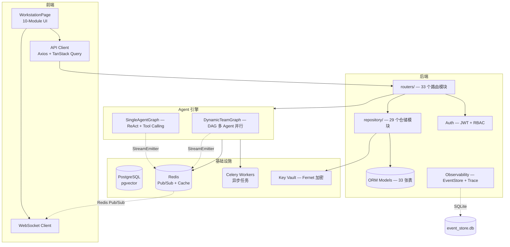

<div align="center">
<a name="readme-top"></a>

# AgentStudio

> 配置、编排、运行多 Agent 工作流的开源平台。

[](https://github.com/CJLOdyssey/agent-studio/actions/workflows/ci.yml)
[](https://opensource.org/licenses/MIT)
[](https://www.typescriptlang.org/)
[](https://reactjs.org/)
[](https://www.python.org/)
[](https://fastapi.tiangolo.com/)
[](https://langchain-ai.github.io/langgraph/)

[](https://github.com/CJLOdyssey/agent-studio/stargazers)

</div>

---

## 目录

- [功能特性](#-功能特性)
- [快速开始](#-快速开始)
- [技术栈](#-技术栈)
- [项目架构](#-项目架构)
- [环境变量](#-环境变量)
- [部署](#-部署)
- [API 文档](#-api-文档)
- [贡献](#-贡献)
- [安全](#-安全)
- [License](#-license)

---

## ✨ 功能特性

**双引擎执行**

| 引擎 | 场景 | 特点 |
|------|------|------|
| SingleAgentGraph | 单 Agent 对话 | ReAct 模式，思考链流式输出 |
| DynamicTeamGraph | 多 Agent 工作流 | DAG 编排，fan-out/fan-in 并行 |

**核心能力**

- **实时流式输出** — WebSocket + Redis pub/sub，打字机效果
- **MCP 协议** — 接入 Model Context Protocol，即插即用
- **BYOK 密钥保险箱** — Fernet 加密存储，支持多密钥轮转
- **RBAC 认证** — JWT + 角色权限，细粒度访问控制
- **全链路可观测** — trace 追踪、Prometheus 指标、事件审计
- **记忆系统** — 上下文压缩、语义缓存、RAG 增强
- **成本追踪** — Token 用量、模型定价、预算告警
- **监控告警** — SLO 定义、自定义规则、多渠道通知

**工作台**

团队管理、工作流、Agent 管理、提示词管理、输出约束、工具管理、MCP 管理、Skills 管理、监控中心、审计日志 — 10 个模块一站式管理。

---

## 🚀 快速开始

项目支持三种启动方式（详见 [QUICKSTART.md](QUICKSTART.md)），端口各不相同——一眼可区分：

| 模式 | 后端 | 前端 | 数据库 | Redis | 用途 |
|------|------|------|--------|-------|------|
| 🐳 全容器化 | `8080` | `5173` | Docker | Docker | 一键拉起全部服务 |
| 🔀 混合模式 | `8091` | `5174` | Docker | Docker | 日常开发（后端 systemd 守护 + 前端热更新） |
| ☁️ 云 Docker | 远程 | 远程 | 远程 | 远程 | 生产部署 |

### 全容器化（最省事）

```bash
git clone https://github.com/CJLOdyssey/agent-studio.git
cd agent-studio
cp .env.example .env  # 填入 DEEPSEEK_API_KEY
docker compose -f docker/compose.base.yml -f docker/compose.local.yml up -d
```

访问 http://localhost:5173

### 混合模式（本地代码 + Docker 数据库，推荐开发）

```bash
# ① 启动数据库（PostgreSQL + Redis）
docker compose -f docker/compose.base.yml -f docker/compose.local.yml up -d postgres redis

# ② 后端 API（端口 8091，systemd 守护；无需手动敲 uvicorn）
cp .env.example .env
systemctl --user restart agent-studio-backend
# 备用（无 systemd）：make dev-backend
# 2. 后端：systemd user service 守护（后端端口 8091）
systemctl --user restart agent-studio-backend   # 重启后端
systemctl --user status  agent-studio-backend   # 查看状态
journalctl --user -u agent-studio-backend -f    # 实时日志
# 服务文件：~/.config/systemd/user/agent-studio-backend.service（已 enable，Restart=always 崩溃自动拉起）

# ③ 前端开发服务器（端口 5174，热更新；vite proxy 已指向 8091）
cd frontend && npm run dev
# → http://localhost:5174
```

> **必填变量**：`DEEPSEEK_API_KEY`（LLM 推理）、`AUTH_SECRET`（JWT 签名，≥32 字符）、`KEY_VAULT_SECRET`（密钥加密，≥32 字符）。完整列表见 [环境变量](#-环境变量)。

---

## 🛠 技术栈

| 层级 | 技术 |
|------|------|
| 前端 | React 18 + TypeScript + Vite 6 + Ant Design 6 + Tailwind CSS v4 |
| 后端 | FastAPI + SQLAlchemy async + Redis + Celery（可选，`RUN_DISPATCH=thread` 默认线程） |
| 数据库 | PostgreSQL (pgvector) + Redis |
| Agent 引擎 | LangGraph + LangChain |
| 认证 | JWT + RBAC |
| 可观测 | OpenTelemetry + Prometheus |
| 部署 | Docker Compose + Helm (K8s) |

---

## 🏗 项目架构


```mermaid
graph TB
    subgraph Frontend["前端"]
        WS[WebSocket Client]
        UI[WorkstationPage<br/>10-Module UI]
        API[API Client<br/>Axios + TanStack Query]
    end

    subgraph Backend["后端"]
        RTR[routers/ — 33 个路由模块]
        REP[repository/ — 29 个仓储模块]
        ORM[(ORM Models — 33 张表)]
        AUTH[Auth — JWT + RBAC]
        OBS[Observability — EventStore + Trace]
    end

    subgraph Engines["Agent 引擎"]
        SA[SingleAgentGraph — ReAct + Tool Calling]
        DT[DynamicTeamGraph — DAG 多 Agent 并行]
    end

    subgraph Infra["基础设施"]
        PG[(PostgreSQL<br/>pgvector)]
        RD[(Redis<br/>Pub/Sub + Cache)]
        CL(Celery Workers<br/>异步任务)
        KV[Key Vault — Fernet 加密]
    end

    UI --> API
    UI --> WS
    API --> RTR
    RTR --> REP --> ORM
    RTR --> AUTH
    RTR --> Engines
    Engines --> CL
    Engines --> RD
    SA -.->|StreamEmitter| RD
    DT -.->|StreamEmitter| RD
    RD -.->|Redis Pub/Sub| WS
    REP --> KV
    OBS -.->|SQLite| OBS_DB[("event_store.db")]
```

---

## 🔧 环境变量

### 必填

| 变量 | 说明 |
|------|------|
| `DATABASE_URL` | PostgreSQL 连接串 |
| `REDIS_URL` | Redis 连接串 |
| `AUTH_SECRET` | JWT 签名密钥（≥32 字符） |
| `KEY_VAULT_SECRET` | Fernet 加密密钥（≥32 字符） |
| `DEEPSEEK_API_KEY` | DeepSeek API 密钥（主推理模型） |

### LLM 配置

| 变量 | 默认值 | 说明 |
|------|--------|------|
| `OPENAI_API_KEY` | — | OpenAI 兼容备选密钥 |
| `OPENAI_BASE_URL` | `https://api.deepseek.com` | API 端点 |
| `OPENAI_MODEL` | `deepseek-v4-flash` | 推理模型 |
| `EMBEDDING_MODEL` | `text-embedding-3-small` | 嵌入模型 |

### 运行配置

| 变量 | 默认值 | 说明 |
|------|--------|------|
| `PORT` | `8080` | 后端端口（全容器模式）；混合模式 dev 脚本为 `8091` |
| `RUN_DISPATCH` | `thread` | 任务分发模式（thread/celery） |
| `AUTH_ENABLED` | `1` | 启用认证（仅本地无认证开发时关闭） |
| `AUTH_MODE` | `legacy` | 认证模式（legacy/rbac）；**生产建议设为 `rbac`** |
| `AUTH_REQUIRE_LOGIN` | — | 设为 `1` 时匿名请求被登录墙拒绝（401） |
| `DEV_MODE` | — | 设为 `1` 启用开发快捷行为（http cookie 等） |
| `RATE_LIMIT` | `120` | 请求限流（次/窗口） |
| `RATE_LIMIT_WINDOW` | `60` | 限流窗口（秒） |

### 可选增强

| 变量 | 默认值 | 说明 |
|------|--------|------|
| `SENTRY_DSN` | — | Sentry 错误追踪 |
| `OBSERVABILITY_ENABLED` | `1` | 全链路可观测（低于 `OBSERVABILITY_MIN_DISK_MB` 自动停止写入） |
| `REDIS_CACHE_ENABLED` | `1` | Redis 缓存 |
| `RAG_MIN_SCORE` | `0.25` | RAG 最小相似度 |
| `CORS_ORIGIN` / `CORS_ORIGINS` | — | 跨域白名单 |
| `UPLOAD_DIR` | — | 附件上传目录 |

> 完整变量列表见 `.env.example`（**72+ 变量**，含 Redis Sentinel、邮件、Celery、CSP、成本预算、告警评估等）。

---

## 🛳 部署

| 方式 | 命令 | 适用场景 |
|------|------|----------|
| 全容器化 | `docker compose -f docker/compose.base.yml -f docker/compose.local.yml up -d` | 一键拉起 |
| 混合模式 | Docker PG/Redis + `systemctl --user restart agent-studio-backend` + `npm run dev` | 日常开发 |
| 生产部署 | `docker compose -f docker/compose.base.yml -f docker/compose.prod.yml up -d` | 服务器部署 |
| Kubernetes | `helm install agent-studio ./helm` | K8s 集群 |

详见 [QUICKSTART.md](QUICKSTART.md)。

### 混合模式运维（systemd 守护）

```bash
systemctl --user restart agent-studio-backend   # 重启
systemctl --user status  agent-studio-backend   # 状态
journalctl --user -u agent-studio-backend -f    # 实时日志

# 健康检查（含 CPU 时间 + 孤儿进程扫描）
make health PORT=8091

# 备用启动（无 systemd）
make dev-backend
```

### 默认账号

| 账号 | 角色 | 说明 |
|------|------|------|
| `admin@example.com` | admin | 种子管理员；密码默认 `admin123`（仅开发），**生产必须设置 `SEED_ADMIN_PASSWORD`** |

---

## 📚 API 文档

启动后访问 Swagger UI 自动文档（端口取决于模式）：

- 全容器模式：http://localhost:8080/docs
- 混合模式：http://localhost:8091/docs

- 健康检查：`GET /api/health`
- OpenAPI schema：`GET /openapi.json`

---

## 🤝 贡献

欢迎贡献！请查看 [CONTRIBUTING.md](CONTRIBUTING.md)。

```bash
# 开发流程
Fork → 创建分支 → 开发 → 测试 → 提交 → Push → PR
```

提交信息遵循 [Conventional Commits](https://www.conventionalcommits.org/)，格式见 `.gitmessage`。

---

## 🔒 安全

发现安全漏洞请**不要**公开提交 Issue。请参考 [SECURITY.md](SECURITY.md) 私信报告。

---

## 📝 License

[MIT](LICENSE)

---

<div align="right">

[](#readme-top)

</div>
