# Database Entity-Relationship Diagram

> Generated from `backend/orm/**/*.py` + `backend/checkpoint/models.py`.  
> 25 tables, 19 foreign-key relationships.

```mermaid
erDiagram
    sessions {
        string id PK
        string title
        string user_id
        string agent_id FK "nullable → agent_configs"
        datetime created_at
        datetime updated_at
    }

    project_runs {
        string id PK
        string session_id FK "nullable → sessions"
        text requirement
        text pm_document
        text code
        text review
        boolean approved
        string status
        datetime created_at
        datetime updated_at
    }

    chat_messages {
        string id PK
        string run_id FK "→ project_runs"
        string role
        string agent_name
        text content
        text thinking "nullable"
        int round_number
        datetime created_at
    }

    memory_entries {
        string id PK
        string session_id FK "→ sessions"
        string run_id FK "nullable → project_runs"
        string agent_role
        string content_type
        string summary
        text details
        datetime created_at
    }

    agent_checkpoints {
        string id PK
        string session_id FK "→ sessions"
        string run_id FK "nullable → project_runs"
        int step_index
        text agent_state
        datetime created_at
    }

    command_logs {
        string id PK
        string session_id FK "→ sessions"
        string command_id
        string command_name
        text payload
        text result
        datetime created_at
    }

    attachments {
        string id PK
        string session_id FK "→ sessions"
        string run_id "nullable"
        string filename
        string content_type
        int size_bytes
        string storage_path
        text extracted_text "nullable"
        datetime created_at
    }

    agent_configs {
        string id PK
        string name
        string role_identifier UK
        text system_prompt
        text output_constraints "nullable"
        text tools "nullable"
        text mcp "nullable"
        text skills "nullable"
        string model "nullable"
        float temperature "nullable"
        int order
        boolean is_active
        boolean is_approver
        string icon
        string owner_id "nullable"
        datetime created_at
        datetime updated_at
    }

    teams {
        string id PK
        string name UK
        string description "nullable"
        string status
        int order
        boolean is_expanded
        string owner_id "nullable"
        string workflow_config_id FK "nullable → workflow_configs"
        datetime created_at
        datetime updated_at
    }

    team_agents {
        string id PK
        string team_id FK "→ teams"
        string agent_config_id FK "nullable → agent_configs"
        string name
        string role
        int order
        datetime created_at
    }

    workflow_configs {
        string id PK
        string team_id FK "→ teams (unique)"
        string name
        int max_rounds
        datetime created_at
        datetime updated_at
    }

    workflow_nodes {
        string id PK
        string workflow_config_id FK "→ workflow_configs"
        string agent_config_id FK "→ agent_configs"
        string role_identifier
        string strategy
        int order
        datetime created_at
    }

    workflow_edges {
        string id PK
        string workflow_config_id FK "→ workflow_configs"
        string from_node_id FK "→ workflow_nodes"
        string to_node_id FK "→ workflow_nodes"
        string condition_key "nullable"
        boolean is_default
        int priority
    }

    users {
        string id PK
        string email UK
        string username UK
        string password_hash
        boolean is_active
        boolean is_verified
        string auth_provider
        string auth_provider_id "nullable"
        int failed_login_attempts
        datetime locked_until "nullable"
        datetime created_at
        datetime updated_at
    }

    roles {
        string id PK
        string name UK
        json permissions
    }

    user_roles {
        string id PK
        string user_id FK "→ users"
        string role_id FK "→ roles"
    }

    refresh_tokens {
        string id PK
        string user_id FK "→ users"
        string token_hash UK
        string family_id
        datetime expires_at
        datetime created_at
        datetime revoked_at "nullable"
        string replaced_by_token_hash "nullable"
    }

    user_api_keys {
        string id PK
        string user_id
        string provider
        string usage_type
        string label
        text encrypted_key
        string base_url "nullable"
        text models
        boolean is_active
        boolean is_default
        datetime last_used_at "nullable"
        datetime created_at
        datetime updated_at
    }

    key_usage_logs {
        string id PK
        string key_id FK "nullable → user_api_keys"
        string user_id
        string run_id "nullable"
        string provider
        string model
        int tokens_prompt
        int tokens_completion
        int tokens_total
        float cost_estimate_usd
        int duration_ms
        string status
        text error_message "nullable"
        datetime created_at
    }

    prompts {
        string id PK
        string name
        string category
        text content
        string model "nullable"
        string status
        string version
        string owner_id "nullable"
        datetime created_at
        datetime updated_at
    }

    registered_tools {
        string id PK
        string name
        string category
        text description
        string model "nullable"
        string status
        string version
        string endpoint
        string method
        text headers
        text parameters
        string owner_id "nullable"
        datetime created_at
        datetime updated_at
    }

    mcp_servers {
        string id PK
        string name
        string type
        string endpoint
        text config "nullable"
        string status
        string owner_id "nullable"
        datetime created_at
        datetime updated_at
    }

    registered_skills {
        string id PK
        string name
        string category
        text content
        string author "nullable"
        string version
        string status
        text instructions "nullable"
        string prompt_id "nullable"
        json tool_names "nullable"
        text output_constraint "nullable"
        datetime created_at
        datetime updated_at
    }

    versions {
        string id PK
        string resource_type
        string resource_id
        int version_num
        json snapshot
        string created_by "nullable"
        datetime created_at
        datetime updated_at
    }

    audit_logs {
        string id PK
        string action
        string entity_type
        string entity_name
        text detail
        datetime created_at
    }

    %% ── Core run pipe ──
    sessions ||--o{ project_runs : "has"
    project_runs ||--o{ chat_messages : "contains"

    %% ── Memory & checkpoint ──
    sessions ||--o{ memory_entries : "records"
    sessions ||--o{ agent_checkpoints : "snapshots"
    project_runs ||--o{ memory_entries : "context of"
    project_runs ||--o{ agent_checkpoints : "state of"

    %% ── Agent- and session-scoped ──
    agent_configs ||--o{ sessions : "powers"
    sessions ||--o{ command_logs : "logs"
    sessions ||--o{ attachments : "holds"

    %% ── Team topology ──
    teams ||--o{ team_agents : "members"
    agent_configs ||--o{ team_agents : "role"

    %% ── Workflow DAG ──
    teams ||--o| workflow_configs : "defines"
    workflow_configs ||--o{ workflow_nodes : "nodes"
    workflow_configs ||--o{ workflow_edges : "edges"
    workflow_nodes ||--o{ workflow_edges : "from"
    workflow_nodes ||--o{ workflow_edges : "to"
    agent_configs ||--o{ workflow_nodes : "assigned to"

    %% ── Auth & RBAC ──
    users ||--o{ refresh_tokens : "has"
    users ||--o{ user_roles : "granted"
    roles ||--o{ user_roles : "assigned"

    %% ── Key vault & usage ──
    user_api_keys ||--o{ key_usage_logs : "audit"
```

## Foreign-Key Chain Summary

| Chain | Cardinality | Diagram |
|-------|-------------|---------|
| `sessions` → `project_runs` → `chat_messages` | 1:N → 1:N | Core run pipeline |
| `sessions` → `memory_entries` + `agent_checkpoints` | 1:N (parallel) | Memory & state snapshots |
| `sessions` → `command_logs`, `attachments` | 1:N | Session-scoped metadata |
| `agent_configs` → `sessions`, `team_agents`, `workflow_nodes` | 1:N | Agent wiring |
| `teams` → `team_agents` ← `agent_configs` | M:N via join | Team composition |
| `teams` → `workflow_configs` → `workflow_nodes` → `workflow_edges` | 1:1 → 1:N → 1:N | Workflow DAG |
| `users` → `user_roles` ← `roles` | M:N via join | RBAC |
| `users` → `refresh_tokens` | 1:N | JWT token rotation |
| `user_api_keys` → `key_usage_logs` | 1:N | LLM call audit |
| `project_runs` → `memory_entries`, `agent_checkpoints` | 1:N | Context & state per run |

### Standalone tables (no outgoing FKs)

`prompts`, `registered_tools`, `mcp_servers`, `registered_skills`, `versions`, `audit_logs` — these are reference/content tables with no foreign-key children.
